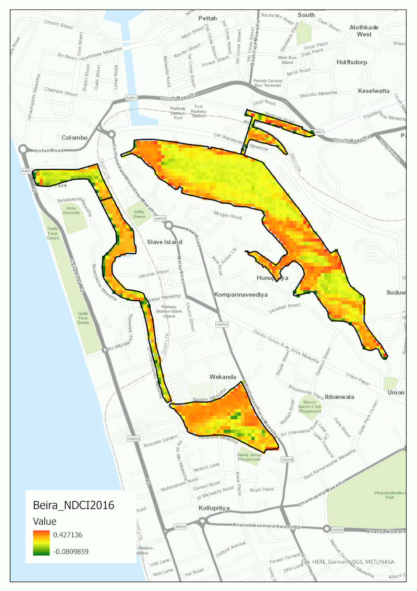

# Chlorophyll-Concentration-Analysis
Chlorophyll Concentration Analysis of Beira Lake (2016–March 2024)

## **Overview**

- This project analyzes temporal variations in chlorophyll concentration in Beira Lake, Sri Lanka, using Sentinel-2 imagery. The Normalized Difference Chlorophyll Index (NDCI) was applied to assess algal dynamics and infer changes in water quality over time.

## **Study Area**

- Beira Lake is located within the Central Business District of the Western Region of Sri Lanka, in close proximity to the Colombo Port and the Port City development. The lake is heavily influenced by anthropogenic activities, including urban runoff, wastewater discharge, and land-use pressures. It covers an area of approximately 65.4 hectares and has an average depth of about 2.0 meters. The surrounding terrain is generally flat, with elevations ranging from less than 1 meter to around 6 meters above mean sea level. The lake’s catchment area extends to roughly 629 hectares and is divided into five main basins.

- As a distinctive urban water body, Beira Lake contributes both environmental and economic value to the region and holds significant potential for waterfront development amid the rapid urbanization of Colombo. However, at present, the lake is subjected to multiple incompatible uses, including solid waste dumping and the discharge of domestic wastewater, which have contributed to its environmental degradation.

### **Data**

| Data | Source | Description |
|------|--------|-------------|
| Sentinel-2 MSI (Level-1C) | [Copernicus Open Access Hub](https://browser.dataspace.copernicus.eu) | Cloud-free images 2016–March 2024 |
| Bands | **B4 (Red), B5 (Red-edge)** | Used for NDCI calculation |
| DEM  | [Alaska Satellite Facility](https://search.asf.alaska.edu/#/) | Elevation |
| Lake boundary shapefile| Manually digitized | Boundary digitized manually from Sentinel-2 imagery for analysis |

> **Note:** Large satellite imagery files are not included. Links to download Sentinel-2 products are provided.

## **Tools:**
- ArcGIS Pro
- Microsoft Excel

## **Methodology**

**Chlorophyll Estimation**
- Chlorophyll concentration was estimated using the Normalized Difference Chlorophyll Index (NDCI):

**$$
\mathrm{NDCI} = \frac{B5 - B4}{B5 + B4}
$$**

Where:

B4 = Red band
B5 = Red-edge band

**Workflow**
- Selection of cloud-free Sentinel-2 images
- Subsetting to Beira Lake
- Calculation of NDCI
- Extraction of annual mean values
- Time series analysis (2016–2024)

## Key Findings

| Year       | Trend / Observation |
|-----------|-------------------|
| 2016–2020 | Relatively stable chlorophyll levels; minimal variation in nutrient inputs |
| 2021      | Noticeable decline in mean NDCI (~0.0470), likely linked to reduced anthropogenic activity during COVID-19 lockdown |
| 2022–2024 | Gradual increase in chlorophyll concentration, suggesting renewed nutrient loading and rising eutrophication pressure |

*NDCI Spatial Distribution*

   
  <em>Spatial distribution of chlorophyll concentration (NDCI)</em>

## **Discussion**

The decline in NDCI observed in 2021 may be linked to reduced anthropogenic activity during the COVID-19 lockdown period. Lower levels of industrial discharge, urban runoff, and wastewater input could have temporarily reduced nutrient loading into the lake. Since algal growth responds rapidly to nutrient availability, even short-term reductions can lead to a measurable decrease in chlorophyll concentration.

However, this decline cannot be attributed solely to lockdown effects. Other environmental factors, such as rainfall variability, hydrological conditions, and seasonal dynamics, may also have influenced the observed pattern.

The increasing trend after 2021 suggests a return of nutrient inputs and a potential rise in eutrophication, indicating growing environmental pressure on the lake.

## **Environmental Implications**
- Increased risk of eutrophication
- Potential for harmful algal blooms
- Degradation of urban water quality

This highlights the importance of continuous monitoring and improved urban water management strategies.

## **Limitations**
- Use of TOA reflectance (Level-1C) instead of surface reflectance
- No in-situ validation data
- Possible cloud and seasonal effects
- Sensitivity of NDCI to turbidity

## **Future Improvements**
- Use Sentinel-2 Level-2A data
- Integrate field measurements
- Apply machine learning models

## References
- Urban Development Authority (UDA). (2022). *Beira Lake Intervention Area Development Guide Plan (2022–2031)*. Colombo, Sri Lanka.  
  [Download PDF](https://www.uda.gov.lk/attachments/dev-plans-2021-2030/beira_lake-English.pdf)

Author : Theekshana Pathirana
BSc. in Geographical Information Science
